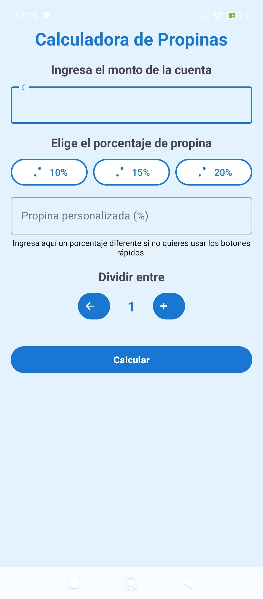

# Calculadora de Propina

Una aplicación Android desarrollada en Kotlin que permite calcular propinas de manera rápida y sencilla.



## Características

- 🎨 Diseño moderno y minimalista
- 💙 Tema azul elegante
- ⚡ Cálculo instantáneo de propinas
- 📱 Interfaz intuitiva y fácil de usar
- 🔄 Actualización en tiempo real
- ✅ Validación de entrada
- 📐 Diseño responsive
- 👥 Opción para dividir la cuenta entre varias personas

## Tecnologías Utilizadas

### Lenguaje y Framework
- Kotlin 1.9.0
- Android SDK 34
- Gradle 8.0

### UI/UX
- Material Design 3
- ConstraintLayout
- RecyclerView
- CardView
- Material Components

### Arquitectura y Patrones
- MVVM (Model-View-ViewModel)
- LiveData
- ViewBinding
- Coroutines para operaciones asíncronas

### Herramientas de Desarrollo
- Android Studio Hedgehog
- Git para control de versiones
- GitHub para gestión del repositorio

## Requisitos

- Android 5.0 (API level 21) o superior
- Android Studio Arctic Fox o superior

## Instalación

1. Clona este repositorio:
```bash
git clone https://github.com/JosueMairao/Calculadora-de-Propina.git
```

2. Abre el proyecto en Android Studio
3. Ejecuta la aplicación en tu dispositivo o emulador

## Uso

1. Ingresa el monto de la cuenta
2. Selecciona el porcentaje de propina deseado
3. Si lo deseas, ingresa el número de personas para dividir la cuenta
4. La aplicación calculará automáticamente el monto de la propina y el total a pagar

## Capturas de Pantalla

### Pantalla Principal


### Cálculo de Propina


## Contribución

Las contribuciones son bienvenidas. Por favor, abre un issue primero para discutir los cambios que te gustaría hacer.

## Licencia

The MIT License (MIT)

Copyright (c) 2025 Josue Goncalves Mairao

Permission is hereby granted, free of charge, to any person obtaining a copy of this software and associated documentation files (the "Software"), to deal in the Software without restriction, including without limitation the rights to use, copy, modify, merge, publish, distribute, sublicense, and/or sell copies of the Software, and to permit persons to whom the Software is furnished to do so, subject to the following conditions:

The above copyright notice and this permission notice shall be included in all copies or substantial portions of the Software.

THE SOFTWARE IS PROVIDED "AS IS", WITHOUT WARRANTY OF ANY KIND, EXPRESS OR IMPLIED, INCLUDING BUT NOT LIMITED TO THE WARRANTIES OF MERCHANTABILITY, FITNESS FOR A PARTICULAR PURPOSE AND NONINFRINGEMENT. IN NO EVENT SHALL THE AUTHORS OR COPYRIGHT HOLDERS BE LIABLE FOR ANY CLAIM, DAMAGES OR OTHER LIABILITY, WHETHER IN AN ACTION OF CONTRACT, TORT OR OTHERWISE, ARISING FROM, OUT OF OR IN CONNECTION WITH THE SOFTWARE OR THE USE OR OTHER DEALINGS IN THE SOFTWARE.

## Contacto

Josue Mairao - [josue.sp@hotmail.com](mailto:josue.sp@hotmail.com)

Link del proyecto: [https://github.com/JosueMairao/Calculadora-de-Propina](https://github.com/JosueMairao/Calculadora-de-Propina)
